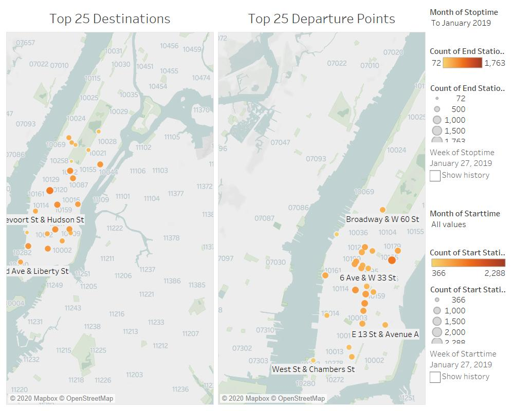

# tableau_challenge
Week 20 Homework

#Link to Tableau Workbook:
https://public.tableau.com/profile/clay.selleck#!/vizhome/Citi_Bikes_15929776700900/OverallBreakdownofCitiBikes
Check out this link to get the fully interactive data model- below is a summary of my findings.

# Citi Bikes

I chose the time period between Jan 1, 2019 through May 31, 2020. I wanted to see the most recent data, and take alook at the effects of the Covid-19 virus on the program.

My first look at the data was to give an overall synopsis of the key measurements. 

# As one would expect, in 2019 the data is more typical. The total number of rides taken per month is normally distributed throughout the year. 

# Men are a larger portion of the overall customer base, although that trend is reversing going into 2020. It is too soon to say if this is a result of the marketing campaign to  target female riders, or a side effect of the corona virus.

# Since the bikes are charged by the minute, I wanted to look at not just the number of trips, but the number of minutes ridden overall by month. Males make up a larger percentage of the total miles ridden than their female couterparts, meaning they take longer trips.

This is a map that shows overall traffic at each station- the sum of both the departures and arrivals at that station. This will give an indication as to the proper inventory of bikes at each station going forward. For more details, see the interactive map published on Tableau.

This dashboard shows the top 25 departure and arrival points over time. See the fully animated version on Tableau. 

One thing of note- Most of the departure points are on the bike stations on Broadway, whereas the arrival points are more distributed. However, the top 25 never leave Manhattan for either chart.

This dashboard gave me some very surprising results. As expected, when Covid-19 started to have it's largest effect in NYC, the number of rides dropped dramatically- especially in March when the city locked down fully. 

# the total trip duration increased dramatically during covid- I charted equivalent weeks from the year before to highlight this. This could be due to the desire of the rider to have a sterilized bike- Instead of renting one bike for each trip during the pandemic, they are choosing to keep the one they have longer, possibly for multiple trips. This could also be due to the fact that people are less likely to use mass transit due to the transmission risk- instead of riding to the subway or bus stop, they could be riding to their end destination.

# the average age of riders during the pandemic stayed very stable- less than a 1% difference from the year before, month after month. Given the risk of Covid to certain age groups, I took a closer look. The number of thrips by age groups from spring of 2019 and during the Covid-19 pandemic were almost identical, even if the number of trips were smaller. This suggests that the customer base remains strong, and most likely consistent. However, there was no user identification data to corroborate.

As a result of the results I have shown, I would make two recommendations: Continue to market to the ladies- it appears to be working. Also, it might be worthwhile to show Citibikes as a safe and reasonable alternative to traditional mass transit- it's easy to social distance on a bike, but more problematic on the bus or subway.
